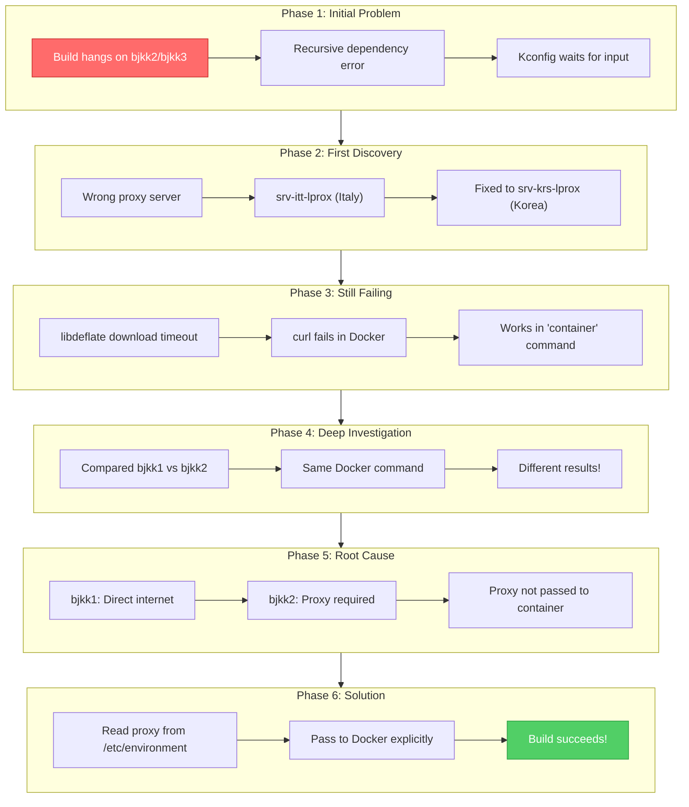
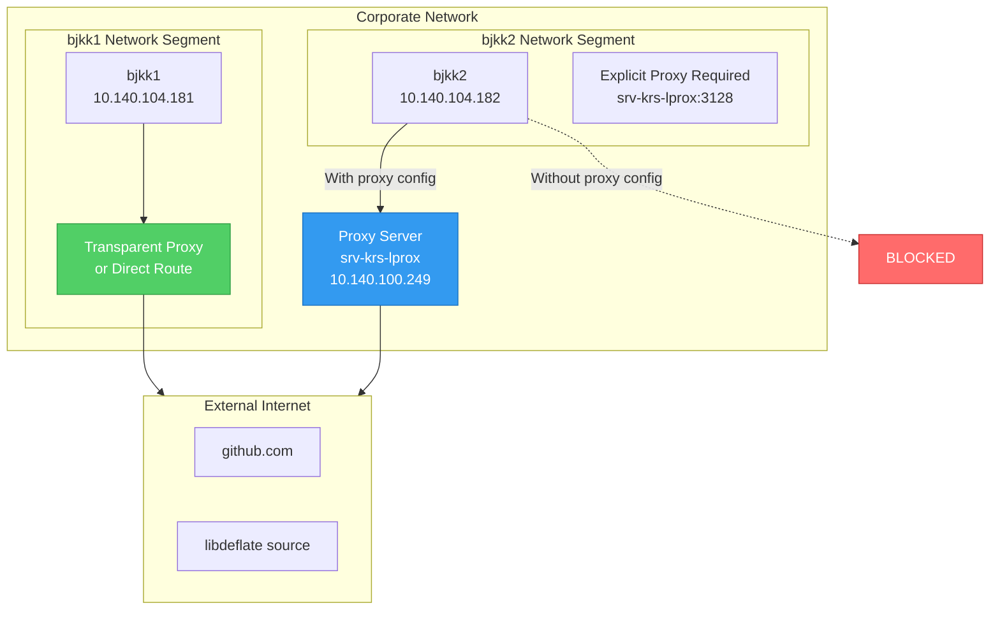
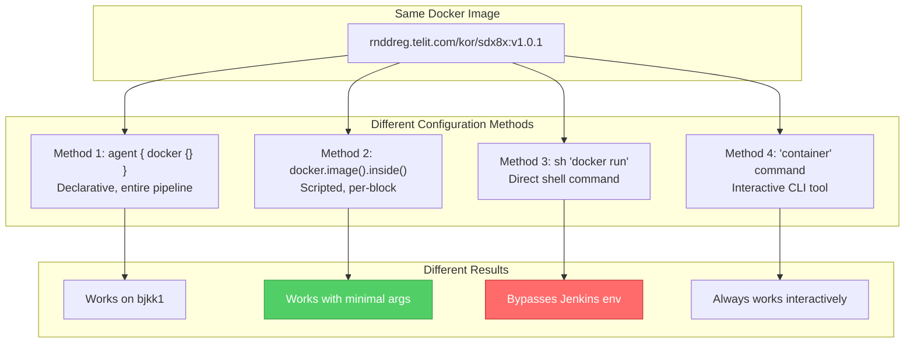
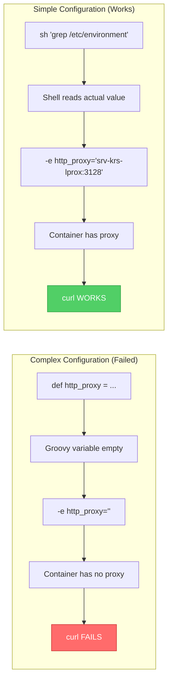
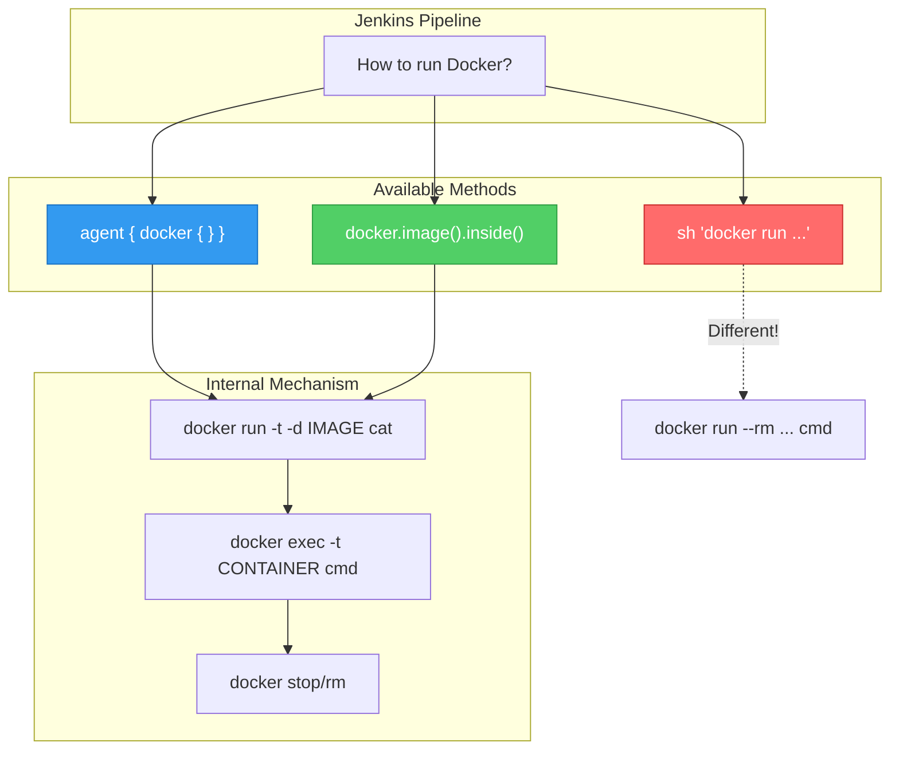
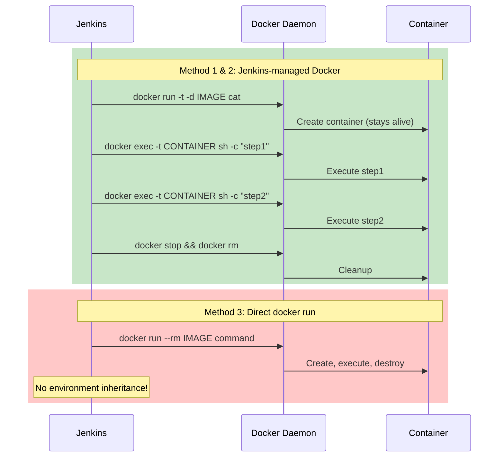
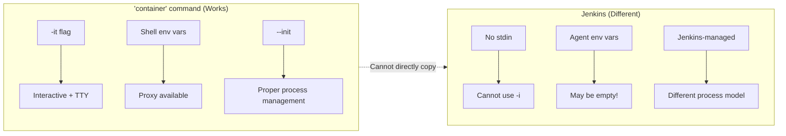
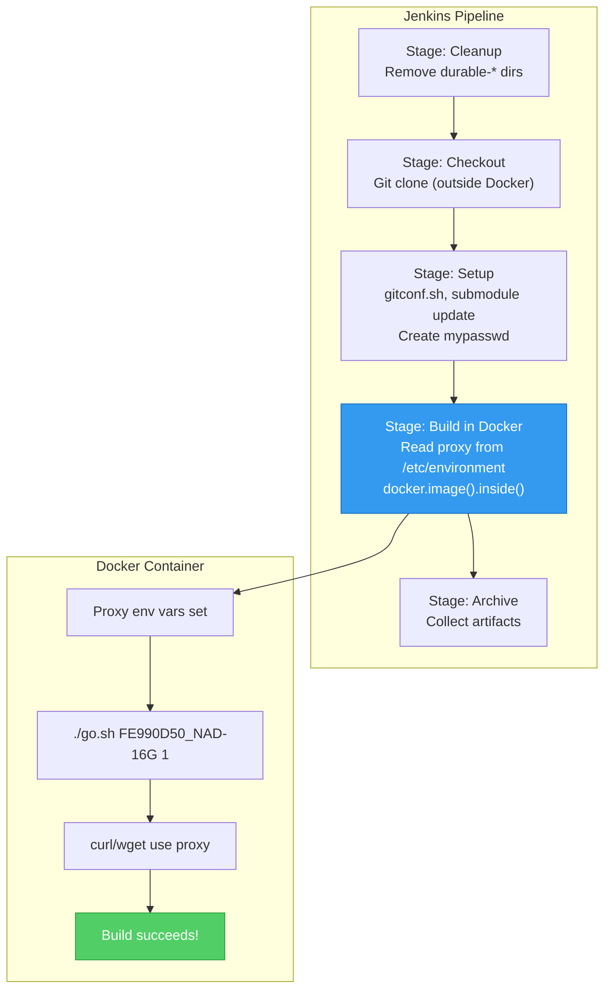
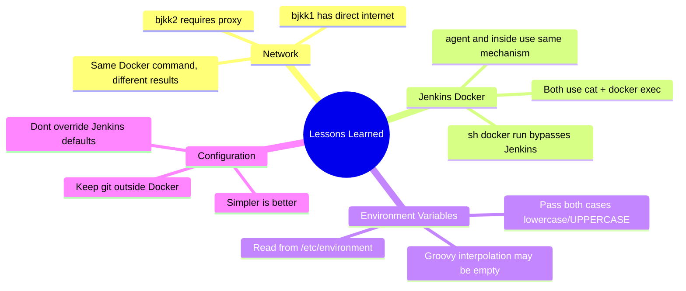

# Jenkins Docker Build Journey - Complete Guide

## Overview

This document is a comprehensive summary of the journey to resolve Jenkins Docker build failures on the SDX8x platform. It covers the investigation, root causes discovered, and the final working solution.

> [!abstract] Executive Summary
> After extensive investigation, we discovered that **bjkk1 has direct internet access** (no proxy required), while **bjkk2 requires explicit proxy configuration**. The solution involves reading proxy settings from `/etc/environment` and passing them to Docker containers. Additionally, we learned that Jenkins' `docker.image().inside()` method with **minimal arguments** is the recommended approach.

---

## Table of Contents

- [[#The Journey Timeline]]
- [[#Why bjkk1 Works Without Proxy But bjkk2 Requires It]]
- [[#Container Configuration Methods Comparison]]
- [[#Docker Methods in Jenkins Groovy Files]]
- [[#Recommended Configuration Approach]]
- [[#The Final Working Solution]]
- [[#Lessons Learned]]

---

## The Journey Timeline



---

## Why bjkk1 Works Without Proxy But bjkk2 Requires It

### The Discovery

During testing, we ran the **exact same Docker command** on both servers:

```bash
docker run -it -u 1474442670:1474400513 \
  --hostname srv-krs-bjkkX \
  -e USER=svc_krs_jenkins \
  -v $HOME:$HOME \
  -v /jenhome:/jenhome \
  rnddreg.telit.com/kor/sdx8x:v1.0.1
```

| Server | Inside Container: `echo $http_proxy` | curl to github.com |
|--------|--------------------------------------|-------------------|
| bjkk1 | (empty) | **WORKS** |
| bjkk2 | (empty) | **FAILS** |

> [!important] Key Finding
> bjkk1 can access the internet **without proxy configuration**, while bjkk2 **cannot**.

### Network Topology Explanation



### Possible Reasons for the Difference

| Hypothesis | Explanation |
|------------|-------------|
| **Transparent Proxy** | bjkk1's network segment has a transparent proxy that automatically intercepts HTTP/HTTPS traffic |
| **Different VLAN** | bjkk1 and bjkk2 are on different VLANs with different firewall rules |
| **Firewall Rules** | bjkk1 has outbound 443/80 allowed; bjkk2 has these ports blocked (must use proxy) |
| **Network Routing** | bjkk1 has a direct route to internet; bjkk2's route goes through a firewall that requires proxy |

### Verification Test

To confirm this theory, run inside Docker container **without** proxy environment variables:

```bash
# On bjkk1
docker run --rm rnddreg.telit.com/kor/sdx8x:v1.0.1 \
  curl -v --connect-timeout 10 https://github.com

# On bjkk2
docker run --rm rnddreg.telit.com/kor/sdx8x:v1.0.1 \
  curl -v --connect-timeout 10 https://github.com
```

**Expected Results:**
- bjkk1: Connection succeeds
- bjkk2: Connection times out or refused

---

## Container Configuration Methods Comparison

> [!info] Related Document
> For detailed comparison of Docker execution methods, see [[Docker_Environment_Configuration_Comparison]]

### The Same Image, Different Configurations

Throughout this investigation, we used the same Docker image (`rnddreg.telit.com/kor/sdx8x:v1.0.1`) but with vastly different configurations:



### Configuration Comparison Table

| Aspect | Working (bjkk1 simple) | Failing (bjkk2 complex) | Final Solution |
|--------|------------------------|-------------------------|----------------|
| **Proxy env vars** | Not passed | Passed with wrong method | Read from /etc/environment |
| **Docker args** | Minimal | Many custom options | Minimal + proxy |
| **--init flag** | Not used | Used | Not used |
| **--security-opt** | Not used | Used | Not used |
| **Environment source** | Jenkins automatic | Manual Groovy interpolation | Shell script extraction |

### Why Complex Configuration Failed



---

## Docker Methods in Jenkins Groovy Files

### Overview of Methods



### Method 1: `agent { docker { } }` (Declarative)

```groovy
pipeline {
  agent {
    docker {
      image 'rnddreg.telit.com/kor/sdx8x:v1.0.1'
      label 'bjkk1'
      args '-v /jenhome:/jenhome -e http_proxy'
    }
  }
  stages {
    stage('Build') {
      steps {
        sh './go.sh FE990D50_NAD-16G 1'
      }
    }
  }
}
```

| Aspect | Description |
|--------|-------------|
| **Scope** | Entire pipeline or stage |
| **Flexibility** | Low - all steps run in container |
| **Environment** | Jenkins handles automatically |
| **Best for** | Simple, single-container pipelines |

### Method 2: `docker.image().inside()` (Scripted) - RECOMMENDED

```groovy
stage('Build') {
  steps {
    script {
      // Read proxy from /etc/environment
      def http_proxy = sh(script: '''
        grep "^http_proxy=" /etc/environment | sed "s/^http_proxy=//" | tr -d "\\\"'"
      ''', returnStdout: true).trim()

      def dockerArgs = """
        -e http_proxy=${http_proxy}
        -e https_proxy=${http_proxy}
        -v \$HOME:\$HOME
        -v /jenhome:/jenhome
      """.stripIndent().trim()

      docker.image('rnddreg.telit.com/kor/sdx8x:v1.0.1').inside(dockerArgs) {
        sh './go.sh FE990D50_NAD-16G 1'
      }
    }
  }
}
```

| Aspect | Description |
|--------|-------------|
| **Scope** | Just the code block inside `{ }` |
| **Flexibility** | High - mix Docker and non-Docker steps |
| **Environment** | Explicit control + Jenkins automatic |
| **Best for** | Complex pipelines, multi-stage builds |

### Method 3: `sh 'docker run ...'` (Direct Shell) - ANTI-PATTERN

```groovy
stage('Build') {
  steps {
    sh '''
      docker run --rm \
        -e http_proxy=$http_proxy \
        -v /jenhome:/jenhome \
        rnddreg.telit.com/kor/sdx8x:v1.0.1 \
        ./go.sh FE990D50_NAD-16G 1
    '''
  }
}
```

> [!danger] Why This Fails
> - Bypasses Jenkins' automatic environment handling
> - Shell may not have Jenkins environment variables
> - No Jenkins integration for container lifecycle
> - Build logs may be incomplete

### Internal Mechanism Comparison



### Method Comparison Table

| Feature | `agent { docker }` | `docker.image().inside()` | `sh 'docker run'` |
|---------|-------------------|---------------------------|-------------------|
| **Jenkins integration** | Full | Full | None |
| **Environment inheritance** | Automatic | Automatic | Manual (broken) |
| **Container lifecycle** | Entire pipeline | Per-block | Single command |
| **Mix Docker/non-Docker** | No | **Yes** | Yes |
| **Workspace mounting** | Automatic | Automatic | Manual |
| **User ID mapping** | Automatic | Automatic | Manual |
| **Recommended** | Simple cases | **Most cases** | Avoid |

---

## Recommended Configuration Approach

### The Goal: Match Engineer's Working Environment

Engineers use the `container` command for interactive development:

```bash
container sdx8x
# Enters Docker with full environment, proxy configured, interactive shell
```

The goal is to replicate this environment in Jenkins **without** interactive mode.

### The Challenge



### The Solution: Minimal Args + Explicit Proxy

> [!success] Recommended Approach
> Use `docker.image().inside()` with **minimal arguments** and **explicitly read proxy** from `/etc/environment`.

```groovy
stage('Build in Docker') {
  steps {
    script {
      // 1. Read proxy from /etc/environment (reliable source)
      def http_proxy = sh(script: '''
        grep "^http_proxy=" /etc/environment 2>/dev/null | \
        sed "s/^http_proxy=//" | tr -d "\\\"'"
      ''', returnStdout: true).trim()

      def https_proxy = sh(script: '''
        grep "^https_proxy=" /etc/environment 2>/dev/null | \
        sed "s/^https_proxy=//" | tr -d "\\\"'"
      ''', returnStdout: true).trim()

      def no_proxy = sh(script: '''
        grep "^no_proxy=" /etc/environment 2>/dev/null | \
        sed "s/^no_proxy=//" | tr -d "\\\"'"
      ''', returnStdout: true).trim()

      // 2. Build minimal Docker args
      def dockerArgs = """
        --hostname srv-krs-${buildServer} \
        -e USER=\$USER \
        -e http_proxy=${http_proxy} \
        -e https_proxy=${https_proxy} \
        -e HTTP_PROXY=${http_proxy} \
        -e HTTPS_PROXY=${https_proxy} \
        -e no_proxy=${no_proxy} \
        -e NO_PROXY=${no_proxy} \
        -v /tmp:/tmp \
        -v \$HOME:\$HOME \
        -v \$HOME/mypasswd:/etc/passwd:ro \
        -v /jenhome:/jenhome
      """.stripIndent().trim().replaceAll('\n', ' ')

      // 3. Run build in Docker
      docker.image(dockerImage).inside(dockerArgs) {
        sh './go.sh FE990D50_NAD-16G 1'
      }
    }
  }
}
```

### Pros and Cons of This Approach

#### Pros

| Advantage | Explanation |
|-----------|-------------|
| **Reliable proxy** | Reads from `/etc/environment`, not Jenkins process |
| **Minimal args** | Lets Jenkins handle what it does well |
| **Portable** | Works on any server with proper `/etc/environment` |
| **Hybrid execution** | Git operations outside Docker, build inside |
| **Proper cleanup** | Jenkins manages container lifecycle |

#### Cons

| Disadvantage | Mitigation |
|--------------|------------|
| **More verbose** | One-time setup, copy-paste template |
| **Shell script execution** | Cached in variable, minimal overhead |
| **Not identical to 'container'** | Close enough for builds; test interactively if issues |

### What NOT to Include in Docker Args

Based on lessons learned:

| Arg | Why NOT to Include |
|-----|-------------------|
| `--init` | Jenkins manages processes differently |
| `--security-opt` | Usually not needed, may cause issues |
| `-v /etc/resolv.conf` | Docker handles DNS automatically |
| `-u $(id -u):$(id -g)` | Jenkins adds this automatically |
| `-w ${workspace}` | Jenkins adds this automatically |
| `-i` (interactive) | Jenkins has no stdin, causes Kconfig hang |

### Stage Organization Pattern

```groovy
stages {
  stage('Cleanup') {
    // Remove leftover files from previous Docker runs
  }

  stage('Checkout') {
    // Git operations OUTSIDE Docker (needs SSH credentials)
  }

  stage('Setup') {
    // Prepare scripts, git submodules OUTSIDE Docker
    // Create passwd file for user mapping
  }

  stage('Build in Docker') {
    // Build operations INSIDE Docker
    // Proxy explicitly configured
  }

  stage('Archive') {
    // Archive artifacts OUTSIDE Docker
  }
}
```

---

## The Final Working Solution

### Complete Pipeline Structure



### Key Configuration Files

| File | Purpose | Location |
|------|---------|----------|
| `prebuilt_sdx8x_container.groovy` | Main pipeline definition | `daily_build/SDX8x/` |
| `/etc/environment` | System proxy configuration | Each build server |
| `$HOME/mypasswd` | User mapping for Docker | Created at runtime |

### Verification Checklist

- [x] Proxy read from `/etc/environment`
- [x] Both lowercase and UPPERCASE proxy vars passed
- [x] Git operations outside Docker
- [x] Cleanup stage removes leftover directories
- [x] `docker.image().inside()` with minimal args
- [x] Build succeeds on bjkk2

---

## Lessons Learned

### Technical Lessons



### Process Lessons

| Lesson | Explanation |
|--------|-------------|
| **Test on both servers** | Same configuration may behave differently |
| **Check the basics** | Proxy env vars being empty was the root cause |
| **Compare working vs failing** | bjkk1 vs bjkk2 comparison revealed the issue |
| **Read the actual values** | `echo $http_proxy` inside container showed the truth |
| **Document everything** | This journey documentation helps future debugging |

### Summary Quote

> [!quote] Key Insight
> "When the `container` command works but Jenkins Docker fails, the issue is NOT the Docker invocation method. Both Jenkins methods use the same Docker pattern. The real issue is usually **environment variable handling** or **network configuration differences** between servers."

---

## Related Documents

- [[Docker_Environment_Configuration_Comparison]] - Detailed comparison of Docker methods
- [[SDX8x_Recursive_Dependency_and_Proxy_Resolution]] - Original proxy issue documentation

---

## Quick Reference

### Minimal Docker Args Template

```groovy
def dockerArgs = """
  --hostname srv-krs-${buildServer} \
  -e USER=\$USER \
  -e http_proxy=${http_proxy} \
  -e https_proxy=${https_proxy} \
  -e HTTP_PROXY=${http_proxy} \
  -e HTTPS_PROXY=${https_proxy} \
  -e no_proxy=${no_proxy} \
  -e NO_PROXY=${no_proxy} \
  -v /tmp:/tmp \
  -v \$HOME:\$HOME \
  -v \$HOME/mypasswd:/etc/passwd:ro \
  -v /jenhome:/jenhome
""".stripIndent().trim().replaceAll('\n', ' ')
```

### Proxy Reading Template

```groovy
def http_proxy = sh(script: '''
  if [ -n "$http_proxy" ]; then
    echo "$http_proxy"
  else
    grep "^http_proxy=" /etc/environment 2>/dev/null | \
    sed "s/^http_proxy=//" | tr -d "\\\"'"
  fi
''', returnStdout: true).trim()
```

### Decision Tree

```
Is your Jenkins build failing in Docker?
├── Does 'container' command work interactively?
│   ├── YES → Proxy or environment issue
│   │   ├── Check: echo $http_proxy inside Docker
│   │   │   ├── Empty → Read from /etc/environment
│   │   │   └── Wrong value → Fix /etc/environment
│   │   └── Check: Does same command work on different server?
│   │       ├── YES → Network topology difference
│   │       └── NO → Docker or image issue
│   └── NO → Docker image or host issue
└── Is error about permissions (AccessDeniedException)?
    └── Clean up workspace: rm -rf source_tmp/durable-*
```

---

## Changelog

| Version | Date | Changes |
|---------|------|---------|
| 1.0 | 2025-12-19 | Initial comprehensive guide |

---

*Document Version: 1.0*
*Last Updated: 2025-12-19*
*Author: CI/CD Engineering Team*
