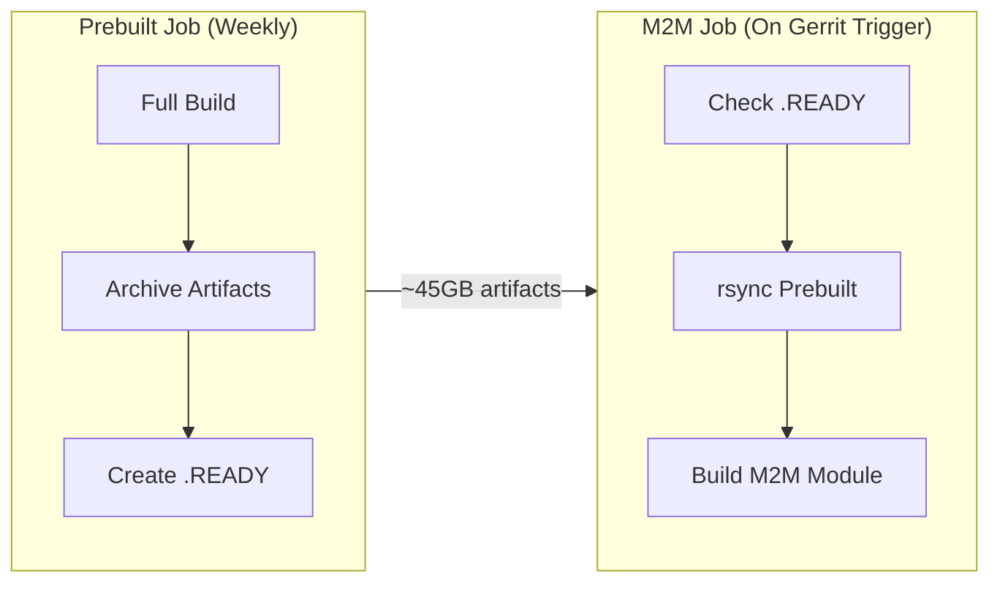
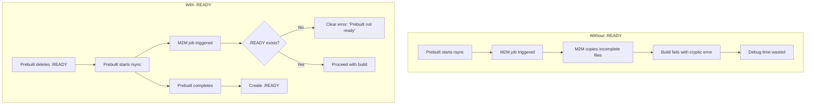

# SDX8x Prebuilt Workflow Documentation

> [!info] Purpose
> This document describes the prebuilt package system for SDX8x builds, designed to reduce M2M module build times by pre-compiling time-consuming components (kernel, base system).

---

## Overview



### Build Time Comparison

| Build Type | Without Prebuilt | With Prebuilt |
|------------|------------------|---------------|
| Full Build | ~4-6 hours | N/A |
| M2M Module | ~4-6 hours | ~30-60 minutes |

---

## Source Files

| File | Location | Purpose |
|------|----------|---------|
| `prebuilt_sdx8x_container.groovy` | `daily_build/SDX8x/` | Jenkins pipeline for prebuilt job |
| `prebuilt.sh` | `daily_build/SDX8x/` | Archive script for prebuilt artifacts |
| `m2m.sh` | `daily_build/gerrit_sh/` | M2M build script (consumes prebuilt) |
| `prebuilt_list_sdx8x.json` | `daily_build/json_config/` | Artifact list configuration |

---

## Workflow Details

### 1. Prebuilt Job

> [!note] Execution Frequency
> Runs intermittently when kernel/base system updates are required, or periodically (every few weeks). Typically scheduled on weekends to avoid conflicts with M2M jobs.

```mermaid
sequenceDiagram
    participant J as Jenkins
    participant G as Groovy Pipeline
    participant D as Docker Container
    participant S as prebuilt.sh
    participant FS as File System

    J->>G: Trigger prebuilt job
    G->>G: Parallel execution on bjkk1, bjkk2, bjkk3

    rect rgb(40, 40, 60)
        Note over G,D: Build Phase
        G->>D: Start Docker container
        D->>D: Execute go.sh FE990 1
        D->>D: Full kernel + apps build (~4-6 hours)
    end

    rect rgb(40, 60, 40)
        Note over S,FS: Archive Phase
        G->>S: Run prebuilt.sh --mode=archive
        S->>FS: Delete old prebuilt (including .READY)
        S->>FS: Create directory structure
        S->>FS: rsync artifacts to /jenhome/jenkins/SDX8x_prebuilt/FE990/
        S->>FS: Copy PREBUILT_METADATA.json
        S->>FS: touch .READY (LAST STEP)
    end
```



### 2. M2M Job

> [!note] Execution Frequency
> Triggered by Gerrit when engineers commit to m2m_qclinux or m2m_generic submodules. May run several times per day.

```mermaid
sequenceDiagram
    participant G as Gerrit
    participant J as Jenkins
    participant M as m2m.sh
    participant FS as File System
    participant B as Build System

    G->>J: Commit triggers M2M job
    J->>M: Execute m2m.sh

    rect rgb(60, 40, 40)
        Note over M,FS: Validation Phase
        M->>FS: Check .READY exists?
        alt .READY missing
            FS-->>M: NOT FOUND
            M->>M: ERROR: Prebuilt not ready
            M->>J: Exit 1
        else .READY exists
            FS-->>M: FOUND
            M->>M: Proceed
        end
    end

    rect rgb(40, 40, 60)
        Note over M,FS: Sync Phase
        M->>FS: rsync prebuilt artifacts (~45GB)
        FS-->>M: Complete
    end

    rect rgb(40, 60, 40)
        Note over M,B: Build Phase
        M->>B: bbbb location-client-api
        M->>B: bbbb m2m
        B-->>J: Build result
    end
```



---

## The .READY Marker File

### Purpose

The `.READY` file is a **completion marker** that prevents race conditions between prebuilt and M2M jobs.



### Lifecycle

| Stage | .READY State | M2M Behavior |
|-------|--------------|--------------|
| Before prebuilt | Exists (from previous run) | Can proceed |
| Prebuilt starts | **Deleted** (entire folder removed) | Fails with clear error |
| Prebuilt running | Does not exist | Fails with clear error |
| Prebuilt completes | **Created** (last step) | Can proceed |

### Why Not Just Use PREBUILT_METADATA.json?

| Aspect | .READY | PREBUILT_METADATA.json |
|--------|--------|------------------------|
| Created | Last step only | Before .READY |
| Content | Empty (0 bytes) | Build info, timestamps, commits |
| Check speed | Instant (file exists) | Requires file read + parse |
| Purpose | Completion signal | Audit trail, debugging |

> [!important] Key Insight
> `.READY` guarantees **atomic completion**. If it exists, ALL artifacts are fully copied. METADATA.json could exist while rsync is still running.

---

## Directory Structure

### Prebuilt Package Location

```
/jenhome/jenkins/SDX8x_prebuilt/FE990/
├── PREBUILT_METADATA.json      # Build metadata (timestamps, commits)
├── .READY                       # Completion marker
└── owrt/
    ├── bin/
    ├── build_dir/
    ├── .config
    ├── dl/
    ├── feeds/
    ├── package/
    ├── staging_dir/
    ├── src/
    │   └── kernel-6.6/
    │       ├── kernel_platform/
    │       └── out/
    │           └── msm-kernel-sdxkova.cpe.wkk-debug_defconfig/
    └── target/
        └── linux/
            └── sdx85/
                └── Makefile    # Modified during build (KERNEL_PLATFORM_TARGET)
```

### Artifact List

Defined in `prebuilt_list_sdx8x.json`:

```json
{
  "artifacts": [
    "bin",
    "build_dir",
    ".ccache",
    ".config",
    ".config.old",
    "dl",
    "feeds",
    "feeds.conf",
    ".kernel_built",
    "key-build",
    "key-build.pub",
    "key-build.ucert",
    "key-build.ucert.revoke",
    "package",
    "staging_dir",
    "src/kernel-6.6",
    "target/linux/sdx85/Makefile"
  ]
}
```

> [!warning] Critical Artifact
> `target/linux/sdx85/Makefile` must be included because it is **modified during the build** to set `KERNEL_PLATFORM_TARGET:=sdxkova.cpe.wkk`. Without this, the M2M build will look for the wrong kernel path.

---

## Troubleshooting

### Common Issues

#### 1. "Prebuilt not ready" Error

```
ERROR: Prebuilt not ready (.READY marker missing)
```

**Cause:** Prebuilt job is currently running, or failed before completion.

**Solution:**
1. Check if prebuilt job is running in Jenkins
2. If not running, re-run prebuilt job
3. Verify `.READY` exists: `ls -la /jenhome/jenkins/SDX8x_prebuilt/FE990/.READY`

#### 2. Kernel Path Mismatch

```
ERROR! Could not find prebuilt kernel artifacts in ../out/msm-kernel-sdxkova-debug_defconfig/
```

**Cause:** `target/linux/sdx85/Makefile` was not included in prebuilt, causing wrong `KERNEL_PLATFORM_TARGET`.

**Solution:**
1. Ensure `target/linux/sdx85/Makefile` is in `prebuilt_list_sdx8x.json`
2. Re-run prebuilt job

#### 3. Kernel Configuration Invalid

```
ERROR: Kernel configuration is invalid.
include/generated/autoconf.h or include/config/auto.conf are missing.
```

**Cause:** Kernel source files missing or incomplete rsync.

**Solution:**
1. Verify prebuilt completed successfully (check .READY)
2. Check kernel output exists: `ls -la /jenhome/jenkins/SDX8x_prebuilt/FE990/owrt/src/kernel-6.6/out/`
3. Re-run prebuilt job if necessary

---

## Verification Commands

### Check Prebuilt Status

```bash
# Verify .READY exists
ls -la /jenhome/jenkins/SDX8x_prebuilt/FE990/.READY

# Check prebuilt timestamp
cat /jenhome/jenkins/SDX8x_prebuilt/FE990/PREBUILT_METADATA.json | jq '.prebuilt_info'

# Check total size
du -sh /jenhome/jenkins/SDX8x_prebuilt/FE990/
```

### Verify Kernel Artifacts

```bash
# Check kernel output directory
ls -la /jenhome/jenkins/SDX8x_prebuilt/FE990/owrt/src/kernel-6.6/out/

# Verify kernel config name
ls /jenhome/jenkins/SDX8x_prebuilt/FE990/owrt/src/kernel-6.6/out/ | grep msm-kernel
# Expected: msm-kernel-sdxkova.cpe.wkk-debug_defconfig
```

### Verify Makefile

```bash
# Check KERNEL_PLATFORM_TARGET value
grep KERNEL_PLATFORM_TARGET /jenhome/jenkins/SDX8x_prebuilt/FE990/owrt/target/linux/sdx85/Makefile
# Expected: KERNEL_PLATFORM_TARGET:=sdxkova.cpe.wkk
```

---

## Server Information

| Server | Role | Prebuilt Job | M2M Job |
|--------|------|--------------|---------|
| bjkk1 | Build server (no proxy) | Yes | Yes |
| bjkk2 | Build server (proxy required) | Yes | Yes |
| bjkk3 | Build server (proxy required) | Yes | Yes |

> [!note] Proxy Configuration
> bjkk2 and bjkk3 require proxy settings. The Groovy pipeline reads proxy from `/etc/environment` and passes to Docker.

---

## Related Documentation

- [[SDX8x Build System Overview]]
- [[Jenkins Pipeline Configuration]]
- [[Docker Build Environment]]

---

## Changelog

| Date | Change | Author |
|------|--------|--------|
| 2024-12-23 | Initial documentation | Claude Code |
| 2024-12-23 | Added `target/linux/sdx85/Makefile` to artifact list | - |
| 2024-12-23 | Fixed `src/kernel-6.6` path preservation in prebuilt.sh | - |
