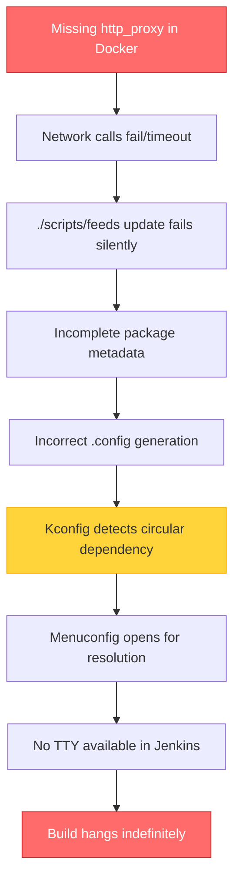
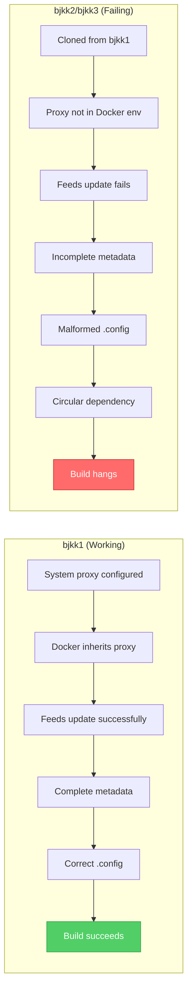
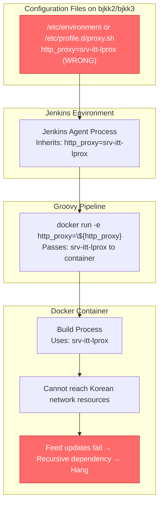
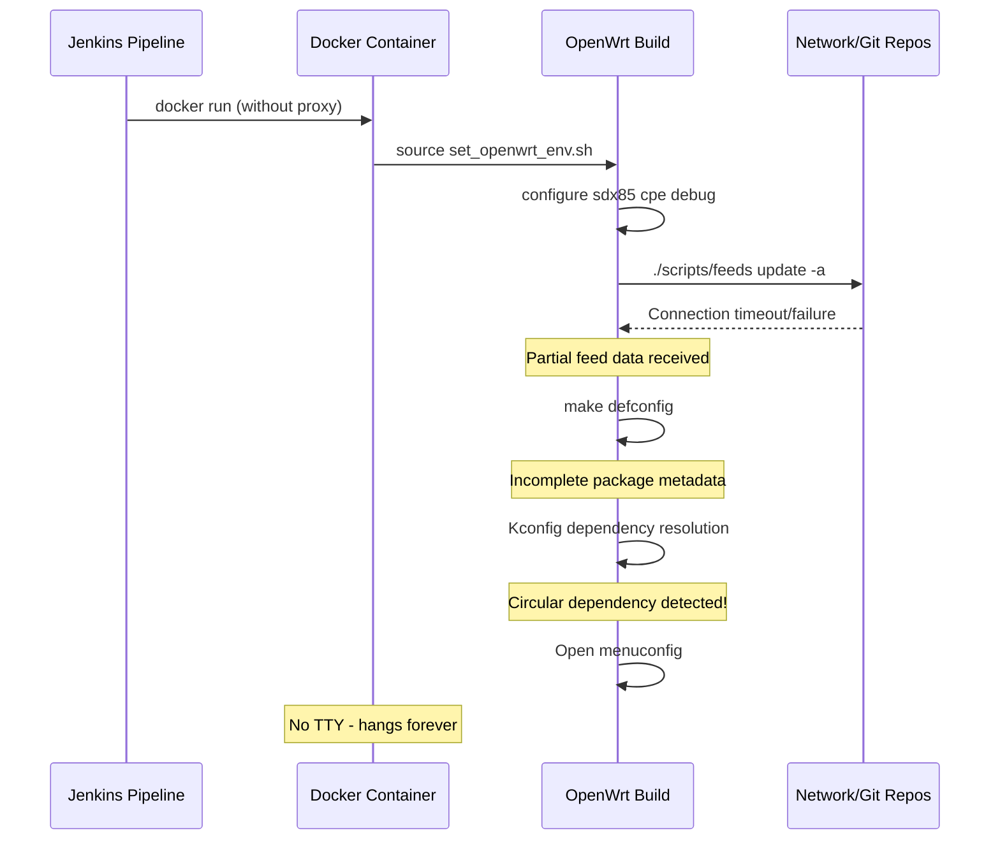
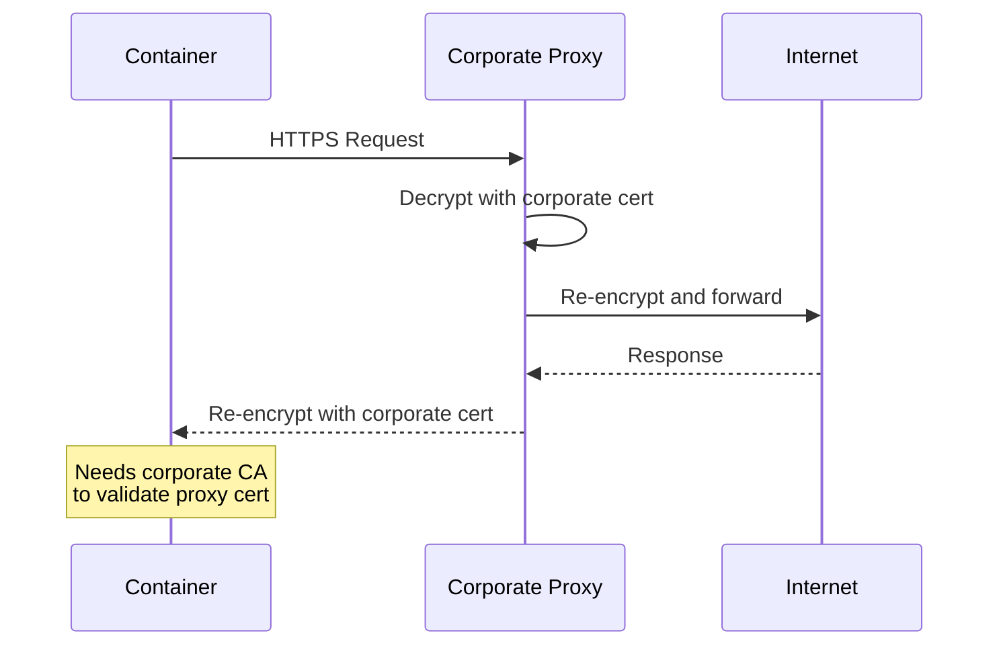
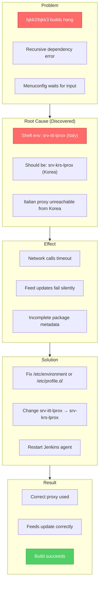
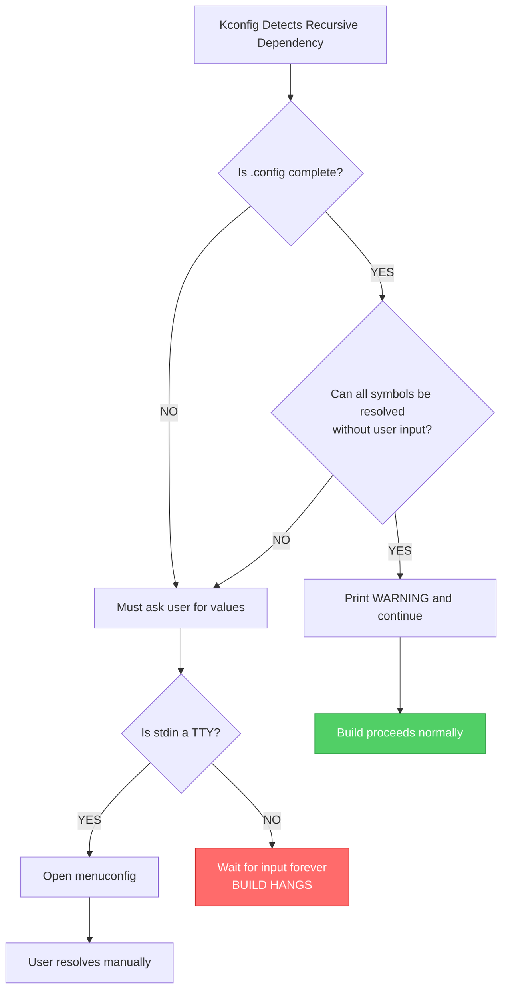
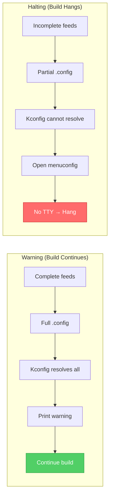

# SDX8x Recursive Dependency Issue and Proxy Resolution

## Overview

This document explains the root cause of the build halt phenomenon that occurred during Jenkins prebuilt jobs when a recursive dependency was detected, and how configuring `http_proxy` settings resolved the issue.

> [!abstract] Summary
> The recursive dependency error was a **symptom**, not the root cause. The actual issue was **missing proxy configuration** in the Docker container, which caused OpenWrt feed updates to fail silently, resulting in incomplete package metadata and apparent circular dependencies.

---

## Table of Contents

- [[#Problem Statement]]
- [[#Root Cause Analysis]]
- [[#The Actual Discovery - Proxy Server Mismatch]]
- [[#The Connection Between Proxy and Recursive Dependency]]
- [[#Technical Deep Dive]]
- [[#Solution Implementation]]
- [[#Docker Parameter Reference]]
- [[#Verification and Testing]]
- [[#Why Recursive Dependency Warnings Don't Always Halt the Build]]
- [[#Final Discovery: Network Topology Difference]]

---

## Problem Statement

### Observed Symptoms

| Server | Build Result | Behavior |
|--------|--------------|----------|
| bjkk1 | Success | Builds complete normally |
| bjkk2 | Failure | Halts waiting for user input |
| bjkk3 | Failure | Halts waiting for user input |

### Error Log Evidence

```log
[2025-12-07T16:50:13.126Z] tmp/.config-package.in:23542:error: recursive dependency detected!
[2025-12-07T16:50:13.126Z] tmp/.config-package.in:23542:  symbol PACKAGE_libopenssl-conf is selected by PACKAGE_libopenssl-legacy
[2025-12-07T16:50:13.126Z] tmp/.config-package.in:23573:  symbol PACKAGE_libopenssl-legacy is selected by PACKAGE_libopenssl-conf
[2025-12-07T16:50:13.126Z] For a resolution refer to Documentation/kbuild/kconfig-language.rst
[2025-12-07T16:50:13.126Z] subsection "Kconfig recursive dependency limitations"
```

> [!danger] Critical Issue
> After the error message, the build process **halted indefinitely** waiting for user input that would never come in the non-interactive Jenkins environment.

### Initial Hypothesis

The user correctly hypothesized that this issue was related to environment differences between servers, as bjkk2 and bjkk3 were cloned from bjkk1.

---

## Root Cause Analysis

### The Hidden Chain of Events



### Why bjkk1 Worked



> [!important] Key Insight
> When servers were cloned, the **host system** inherited proxy settings, but the **Docker containers** did not automatically receive these environment variables. Proxy settings must be explicitly passed via `-e` flags in Docker commands.

---

## The Actual Discovery - Proxy Server Mismatch

### The Smoking Gun

Upon investigating the environment variables on each server, a critical discrepancy was discovered:

#### bjkk1 (Working Server)

```bash
svc_krs_jenkins@srv-krs-bjkk1:~$ echo $http_proxy
http://srv-krs-lprox.tmt.telital.com:3128

svc_krs_jenkins@srv-krs-bjkk1:~$ echo $https_proxy
http://srv-krs-lprox.tmt.telital.com:3128

svc_krs_jenkins@srv-krs-bjkk1:~$ echo $no_proxy
.tmt.telital.com,telit.com
```

#### bjkk2/bjkk3 (Failing Servers)

```bash
svc_krs_jenkins@srv-krs-bjkk2:/$ echo $http_proxy
http://srv-itt-lprox.tmt.telital.com:3128

svc_krs_jenkins@srv-krs-bjkk2:/$ echo $https_proxy
http://srv-itt-lprox.tmt.telital.com:3128

svc_krs_jenkins@srv-krs-bjkk2:/$ echo $no_proxy
.tmt.telital.com,telit.com
```

> [!danger] Critical Finding
> **bjkk2 and bjkk3 were configured with the Italian proxy server (`srv-itt-lprox`)** instead of the Korean proxy server (`srv-krs-lprox`). The Italian proxy cannot route traffic from the Korean data center, causing all network operations to fail or timeout.

### Proxy Configuration Summary

| Server | Shell Environment (`$http_proxy`) | Expected | Status |
|--------|-----------------------------------|----------|--------|
| bjkk1 | `srv-krs-lprox` (Korea) | `srv-krs-lprox` | Correct |
| bjkk2 | `srv-itt-lprox` (Italy) | `srv-krs-lprox` | **Wrong** |
| bjkk3 | `srv-itt-lprox` (Italy) | `srv-krs-lprox` | **Wrong** |

### The Confusing Part - Docker Daemon Config Was Correct

Interestingly, the Docker daemon's proxy configuration was correct on all servers:

```bash
svc_krs_jenkins@srv-krs-bjkk2:/$ cat /etc/systemd/system/docker.service.d/http-proxy.conf
[Service]
Environment="HTTP_PROXY=http://srv-krs-lprox.tmt.telital.com:3128/"
Environment="HTTPS_PROXY=http://srv-krs-lprox.tmt.telital.com:3128/"
Environment="NO_PROXY=localhost,127.0.0.1,.tmt.telital.com,.telit.com"
```

This raised the question: **Why does the Docker daemon config show the correct Korean proxy, but the shell environment shows the Italian proxy?**

### Understanding the Two Different Configurations

#### 1. Docker Daemon Proxy (`/etc/systemd/system/docker.service.d/http-proxy.conf`)

**Purpose:** Configures the Docker daemon (`dockerd`) process itself.

**What it affects:**
- `docker pull` - Downloading images from registries
- `docker build` - Fetching base images during build
- Docker daemon's own network operations

**What it does NOT affect:**
- Environment variables inside containers
- Commands running inside `docker run`
- Your build process inside the container

#### 2. Shell Environment Variables (`$http_proxy`, `$https_proxy`)

**Purpose:** User session environment variables inherited by all child processes.

**What it affects:**
- All processes started in that shell session
- Jenkins agent process (if started from this shell)
- **Containers when you pass `-e http_proxy=${http_proxy}`**

```
┌─────────────────────────────────────────────────────────────────────────────┐
│  Docker Daemon (dockerd)                                                    │
│  ┌─────────────────────────────────────────────────────────────────────┐   │
│  │  Reads: /etc/systemd/system/docker.service.d/http-proxy.conf        │   │
│  │  Uses: srv-krs-lprox (CORRECT)                                      │   │
│  │                                                                      │   │
│  │  Operations affected:                                                │   │
│  │    ✓ docker pull rnddreg.telit.com/kor/sdx8x:v1.0.1                 │   │
│  │    ✓ Downloading image layers                                       │   │
│  └─────────────────────────────────────────────────────────────────────┘   │
│                                                                             │
│  Container (docker run -e http_proxy=${http_proxy})                        │
│  ┌─────────────────────────────────────────────────────────────────────┐   │
│  │  Inherits: Shell environment variables (via -e or Jenkins)          │   │
│  │  Uses: srv-itt-lprox (WRONG!)                                       │   │
│  │                                                                      │   │
│  │  Operations affected:                                                │   │
│  │    ✗ git clone/fetch (timeout/fail)                                 │   │
│  │    ✗ ./scripts/feeds update (timeout/fail)                          │   │
│  │    ✗ curl/wget (timeout/fail)                                       │   │
│  └─────────────────────────────────────────────────────────────────────┘   │
└─────────────────────────────────────────────────────────────────────────────┘
```

### The Inheritance Chain Explained



### Where Shell Environment Variables Come From

The proxy environment variables are typically set in one of these files (in order of precedence):

```bash
# System-wide (affects all users)
/etc/environment                    # Key=value pairs, no export needed
/etc/profile                        # Executed for login shells
/etc/profile.d/*.sh                 # Scripts sourced by /etc/profile
/etc/bash.bashrc                    # System-wide bashrc

# User-specific
~/.bash_profile                     # Login shell
~/.bashrc                           # Interactive non-login shell
~/.profile                          # Login shell (sh compatible)
```

### How to Find the Misconfigured File

> [!tip] Investigation Commands
> Run these commands on bjkk2/bjkk3 to locate the source of the incorrect proxy setting:

```bash
# Check /etc/environment
cat /etc/environment | grep -i proxy

# Check /etc/profile.d/
grep -r "proxy" /etc/profile.d/

# Check /etc/profile
grep -i proxy /etc/profile

# Check user's profile files
grep -i proxy ~/.bashrc ~/.bash_profile ~/.profile 2>/dev/null

# Check systemd user environment
systemctl --user show-environment | grep -i proxy
```

### The Fix Required

Once the file containing `srv-itt-lprox` is identified, it needs to be changed to `srv-krs-lprox`:

```bash
# Example: If found in /etc/environment
# Change FROM:
http_proxy=http://srv-itt-lprox.tmt.telital.com:3128
https_proxy=http://srv-itt-lprox.tmt.telital.com:3128

# Change TO:
http_proxy=http://srv-krs-lprox.tmt.telital.com:3128
https_proxy=http://srv-krs-lprox.tmt.telital.com:3128
```

> [!warning] Requires sudo Privileges
> Modifying system-wide environment files requires administrator privileges. This change must be requested from the infrastructure team.

### Post-Fix Verification

After the infrastructure team makes the changes:

```bash
# 1. Re-login or source the updated file
source /etc/environment  # or re-login

# 2. Verify the environment variable
echo $http_proxy
# Expected: http://srv-krs-lprox.tmt.telital.com:3128

# 3. Test proxy connectivity
curl -I --proxy $http_proxy https://github.com

# 4. Restart Jenkins agent to pick up new environment
sudo systemctl restart jenkins-agent
```

### Why This Happened

> [!info] Probable Cause
> When bjkk2 and bjkk3 were cloned from bjkk1, the server setup team likely:
> 1. Correctly configured the Docker daemon proxy in `/etc/systemd/system/docker.service.d/http-proxy.conf`
> 2. But used their standard server provisioning template for shell environment, which contained Italian proxy settings
> 3. Or the shell environment was configured during initial OS installation with Italian defaults

This is a common pitfall when cloning servers across different geographical regions - configuration files may be updated correctly, but inherited environment settings from the base image or provisioning scripts may retain incorrect values.

---

## The Connection Between Proxy and Recursive Dependency

### OpenWrt Build System Network Dependencies

The OpenWrt build system requires network access at multiple points:



### Network-Dependent Operations in `set_openwrt_env.sh`

```bash
# Line 71-80: set_up_feeds function
function set_up_feeds(){
    rm -rf feeds
    ./scripts/feeds update -a -b || return  # ← REQUIRES NETWORK
    ./scripts/feeds install -a || return     # ← REQUIRES NETWORK
    # ...
}

# Line 115-154: patch_upstream_feeds function
function patch_upstream_feeds(){
    # Applies patches from upstream repositories
    # May require network for git operations
}

# Line 156-176: patch_openssl function
function patch_openssl(){
    # OpenSSL version detection and patching
    # Network required for version checks
}
```

### How Incomplete Feeds Cause Circular Dependencies


---

## Technical Deep Dive

### OpenSSL Package Dependencies

The OpenSSL packages in OpenWrt have complex interdependencies:

```
package/libs/openssl/
├── Makefile
│   └── Defines: libopenssl, libopenssl-conf, libopenssl-legacy
├── Config.in
│   └── Defines: OPENSSL_ENGINE_BUILTIN_* options
└── openssl-module.mk
    └── Defines: Default dependencies for modules
```

#### Dependency Structure

```
┌─────────────────────┐
│   libopenssl        │  (Base library)
└─────────────────────┘
         ↑
         │ depends
         │
┌─────────────────────┐
│  libopenssl-conf    │  (Configuration files)
└─────────────────────┘
         ↑
         │ depends (from openssl-module.mk)
         │
┌─────────────────────┐
│ libopenssl-legacy   │  (Legacy provider)
└─────────────────────┘
```

#### When Circular Dependency Appears

From `include/openssl-module.mk`:

```makefile
define Package/openssl/module/Default
  SECTION:=libs
  CATEGORY:=Libraries
  SUBMENU:=SSL
  DEPENDS:=libopenssl +libopenssl-conf  # ← libopenssl-legacy inherits this
endef
```

From `package/libs/openssl/Config.in`:

```kconfig
config OPENSSL_ENGINE_BUILTIN_DEVCRYPTO
    bool
    prompt "Acceleration support through /dev/crypto"
    depends on OPENSSL_ENGINE_BUILTIN
    select PACKAGE_libopenssl-conf    # ← Potential reverse dependency
```

> [!warning] The Circular Dependency Mechanism
> When feed data is incomplete, Kconfig misinterprets the dependency graph. The `select` statement combined with `depends` can appear circular when metadata is missing:
> ```
> libopenssl-conf ←──── libopenssl-legacy (depends)
>        │
>        └─────────────→ libopenssl-legacy (select via CONFIG option)
> ```

### Why Menuconfig Opens

When Kconfig detects a circular dependency, it attempts to open an interactive menu for manual resolution:

```c
// Simplified Kconfig behavior
if (circular_dependency_detected) {
    if (isatty(stdin)) {
        open_menuconfig();  // Interactive resolution
    } else {
        // Should exit with error, but...
        // Some versions still try to open menu
    }
}
```

In Jenkins Docker environment:
- No TTY allocated (`-i` flag only, no `-t`)
- `stdin` is not a terminal
- But the process still waits for input
- Result: **Indefinite hang**

---

## Solution Implementation

### Proxy Configuration in Docker

> [!success] The Fix
> Pass proxy environment variables explicitly to the Docker container using `-e` flags.

```bash
docker run --rm \
  -i \
  -u $(id -u):$(id -g) \
  -e http_proxy=http://proxy.corp.example.com:8080 \
  -e https_proxy=http://proxy.corp.example.com:8080 \
  -e HTTP_PROXY=http://proxy.corp.example.com:8080 \
  -e HTTPS_PROXY=http://proxy.corp.example.com:8080 \
  -e no_proxy=localhost,127.0.0.1,.telit.com \
  -v /etc/ssl/certs:/etc/ssl/certs:ro \
  ${dockerImage} \
  bash -c './go.sh FE990D50_NAD-16G 1'
```

### Why Both Cases Are Needed

| Variable | Used By | Purpose |
|----------|---------|---------|
| `http_proxy` (lowercase) | curl, wget, most Linux tools | Standard Unix convention |
| `HTTP_PROXY` (uppercase) | Java, some enterprise tools | Windows/Java convention |
| `https_proxy` (lowercase) | curl, wget for HTTPS | Secure connections |
| `HTTPS_PROXY` (uppercase) | Java, enterprise tools | Secure connections |
| `no_proxy` | All tools | Bypass proxy for internal hosts |

### SSL Certificates Mount

```bash
-v /etc/ssl/certs:/etc/ssl/certs:ro
```

> [!note] Why SSL Certificates Are Required
> Corporate proxies often perform SSL/TLS inspection (man-in-the-middle). The container needs access to corporate root CA certificates to validate the proxy's certificate.



---

## Docker Parameter Reference

### Essential Parameters

| Parameter | Required | Purpose |
|-----------|----------|---------|
| `-e http_proxy=...` | **Yes** | Network access through corporate proxy |
| `-e https_proxy=...` | **Yes** | Secure network access |
| `-v /etc/ssl/certs:...:ro` | **Yes** | SSL certificate validation |
| `--hostname` | Recommended | Consistent hostname for builds |
| `-u $(id -u):$(id -g)` | **Yes** | File permission consistency |

### Shell Execution Parameters

```bash
bash --noprofile --norc -c 'command'
```

| Flag | Effect | Importance |
|------|--------|------------|
| `--noprofile` | Skip `/etc/profile`, `~/.bash_profile` | Prevents unexpected env modifications |
| `--norc` | Skip `~/.bashrc` | Prevents aliases/functions interference |
| `-c` | Execute string as command | Non-interactive execution |

> [!tip] Clean Environment
> Using `--noprofile --norc` ensures a predictable build environment, avoiding issues where user configurations might set conflicting variables like `CC`, `PATH`, or `LANG`.

### Security Options

```bash
--security-opt seccomp=unconfined
```

| Setting | Effect | When Needed |
|---------|--------|-------------|
| `seccomp=unconfined` | Disable syscall filtering | Kernel builds, Bazel, chroot operations |

> [!caution] Security Trade-off
> Disabling seccomp reduces container security. Test builds without this option first; only add if specific syscalls are blocked.

---

## Verification and Testing

### Pre-Build Verification Checklist

- [ ] Proxy environment variables set in Docker command
- [ ] SSL certificates mounted from host
- [ ] Network connectivity test passes inside container
- [ ] Feed update completes without errors

### Test Network Connectivity

```bash
# Inside Docker container
curl -I https://github.com
git ls-remote https://github.com/openwrt/openwrt.git HEAD
```

### Verify Feed Updates

```bash
# Check feed update logs
./scripts/feeds update -a 2>&1 | tee feeds_update.log

# Verify no errors
grep -i "error\|fail\|timeout" feeds_update.log
```

### Post-Build Verification

```bash
# Check for recursive dependency in build log
grep -i "recursive dependency" build.log

# Verify successful build
grep "Apps Build success" *build.log
```

---

## Summary



> [!success] Key Takeaways
> 1. **Recursive dependency was a symptom**, not the root cause
> 2. **Wrong proxy server** (`srv-itt-lprox` instead of `srv-krs-lprox`) was the actual root cause on bjkk2/bjkk3
> 3. **Docker daemon config ≠ Container environment** - they are configured separately
> 4. **Proxy settings must be explicitly passed** to Docker containers via `-e` flags
> 5. **SSL certificates are required** for HTTPS through corporate proxy
> 6. **Server cloning pitfall** - shell environment may retain incorrect regional settings
> 7. **Clean shell execution** (`--noprofile --norc`) prevents environment conflicts

---

## Related Documents

- [[Jenkins_Docker_Build_Journey_Complete_Guide]] - Complete journey documentation including final solution
- [[Docker_Environment_Configuration_Comparison]] - Detailed comparison of Docker execution methods
- [[RECURSIVE_DEPENDENCY_ANALYSIS|Detailed Recursive Dependency Analysis]]
- [[Jenkins_Docker_Configuration|Jenkins Docker Configuration Guide]]
- [[OpenWrt_Build_System|OpenWrt Build System Overview]]

---

## Appendix: Quick Reference

### Minimal Docker Command for SDX8x Build

```bash
docker run --rm -i \
  -u $(id -u):$(id -g) \
  -e http_proxy="${http_proxy}" \
  -e https_proxy="${https_proxy}" \
  -e HTTP_PROXY="${HTTP_PROXY}" \
  -e HTTPS_PROXY="${HTTPS_PROXY}" \
  -e no_proxy="${no_proxy}" \
  -e TERM=dumb \
  -e DEBIAN_FRONTEND=noninteractive \
  -v /etc/ssl/certs:/etc/ssl/certs:ro \
  -v /jenhome:/jenhome \
  -w /path/to/workspace \
  rnddreg.telit.com/kor/sdx8x:v1.0.1 \
  bash --noprofile --norc -c './go.sh FE990D50_NAD-16G 1'
```

### Environment Variables Checklist

```bash
# Required for network access
http_proxy=http://proxy.corp.example.com:8080
https_proxy=http://proxy.corp.example.com:8080
HTTP_PROXY=http://proxy.corp.example.com:8080
HTTPS_PROXY=http://proxy.corp.example.com:8080
no_proxy=localhost,127.0.0.1,.internal.domain

# Required for non-interactive builds
TERM=dumb
DEBIAN_FRONTEND=noninteractive
KCONFIG_NOTIMESTAMP=1
```

---

## Why Recursive Dependency Warnings Don't Always Halt the Build

> [!question] The Paradox
> The build log shows `error: recursive dependency detected!` messages, yet the build completes successfully. Previously, the same type of error caused the build to halt indefinitely. Why the difference?

### The Two Scenarios Compared

| Aspect | Previous Issue (Build Halted) | Current Behavior (Build Proceeds) |
|--------|-------------------------------|-----------------------------------|
| Proxy configuration | Missing/Wrong | Correct |
| Feed update result | Failed/Incomplete | Successful/Complete |
| Package metadata | Partial | Complete |
| `.config` state | Indeterminate | Fully resolved |
| Kconfig behavior | Opens menuconfig | Warns and continues |
| Build outcome | Hangs forever | Completes normally |

### Understanding Kconfig's Decision Process



### The Critical Difference: Complete vs Incomplete Metadata

#### When Feeds Are Complete (Current Behavior)

With proper proxy configuration, all feeds update successfully:

```bash
./scripts/feeds update -a    # Downloads ALL package Makefiles
./scripts/feeds install -a   # Installs ALL package definitions
```

Result:
- Kconfig has **complete visibility** of the dependency graph
- Recursive dependencies are **detected but understood**
- The `.config` file from prebuilt contains **predetermined values**
- Kconfig can **proceed without user input**

```
┌─────────────────────────────────────────────────────────────────┐
│  Complete Package Metadata                                       │
├─────────────────────────────────────────────────────────────────┤
│                                                                  │
│  PACKAGE_libopenssl-conf ←──────→ PACKAGE_libopenssl-legacy     │
│         │                                │                       │
│         │  Kconfig sees: "These two select each other"          │
│         │  Kconfig knows: Both are CONFIG_Y in .config          │
│         │  Kconfig decides: "No ambiguity, proceed with warning"│
│         │                                                        │
│         └────────────────────────────────────────────────────────┘
│                                                                  │
│  Result: WARNING printed, build continues                        │
└─────────────────────────────────────────────────────────────────┘
```

#### When Feeds Are Incomplete (Previous Issue)

Without proper proxy, feed updates fail silently:

```bash
./scripts/feeds update -a    # TIMEOUT - partial data received
./scripts/feeds install -a   # Installs INCOMPLETE definitions
```

Result:
- Kconfig has **partial visibility** of dependency graph
- Some package definitions are **missing entirely**
- The `.config` file **cannot be fully resolved**
- Kconfig **must ask user** to resolve ambiguity

```
┌─────────────────────────────────────────────────────────────────┐
│  Incomplete Package Metadata                                     │
├─────────────────────────────────────────────────────────────────┤
│                                                                  │
│  PACKAGE_libopenssl-conf ←──────→ PACKAGE_libopenssl-legacy     │
│         │                                │                       │
│         │  Kconfig sees: "Circular dependency"                  │
│         │  Kconfig missing: Other packages that would clarify   │
│         │  Kconfig decides: "Cannot determine, need user input" │
│         │                                │                       │
│         ▼                                ▼                       │
│    ┌─────────────────────────────────────────────────────┐      │
│    │  Opens menuconfig... but no TTY in Jenkins          │      │
│    │  Process waits for stdin that never comes           │      │
│    │  BUILD HANGS INDEFINITELY                           │      │
│    └─────────────────────────────────────────────────────┘      │
└─────────────────────────────────────────────────────────────────┘
```

### Types of Recursive Dependencies

The current build log shows several types:

#### Type 1: Self-Referential (Bug in Package Definition)

```log
symbol PACKAGE_afc depends on PACKAGE_afc
symbol PACKAGE_qca-afc-daemon depends on PACKAGE_qca-afc-daemon
symbol PACKAGE_qti-wifi-location depends on PACKAGE_qti-wifi-location
```

**Cause:** A bug in the package's Makefile where `DEPENDS` includes itself.

**Example of buggy Makefile:**
```makefile
define Package/afc
  DEPENDS:=+afc +libssl  # BUG: +afc depends on itself!
endef
```

**Why build continues:** Kconfig recognizes this as a definitional error, not an unresolvable dependency. The package is either enabled or disabled - there's no ambiguity.

#### Type 2: Mutual Selection (Intentional Design)

```log
symbol PACKAGE_libopenssl-conf is selected by PACKAGE_libopenssl-legacy
symbol PACKAGE_libopenssl-legacy is selected by PACKAGE_libopenssl-conf
```

**Cause:** Two packages that mutually require each other through `select` statements.

**Why this exists:** OpenSSL's modular design requires both the configuration files and the legacy provider to work together. The Kconfig `select` mechanism ensures both are enabled together.

**Why build continues:** With complete metadata, Kconfig knows:
1. If you enable one, you get both
2. The prebuilt `.config` already has both set to `y`
3. No user input needed

### The Role of Prebuilt `.config`

The prebuilt artifact includes a complete `.config` file that was generated during a successful full build:

```
┌────────────────────────────────────────────────────────────────────┐
│  Prebuilt Artifacts Include:                                        │
│                                                                     │
│  owrt/                                                              │
│  ├── .config          ← CRITICAL: Complete, valid configuration    │
│  ├── .config.old                                                    │
│  ├── build_dir/                                                     │
│  ├── staging_dir/                                                   │
│  └── ...                                                            │
│                                                                     │
│  The .config contains all CONFIG_* values already resolved:        │
│  ┌─────────────────────────────────────────────────────────────┐   │
│  │ CONFIG_PACKAGE_libopenssl=y                                  │   │
│  │ CONFIG_PACKAGE_libopenssl-conf=y                             │   │
│  │ CONFIG_PACKAGE_libopenssl-legacy=y                           │   │
│  │ CONFIG_PACKAGE_afc=y                                         │   │
│  │ ...                                                          │   │
│  └─────────────────────────────────────────────────────────────┘   │
└────────────────────────────────────────────────────────────────────┘
```

When Kconfig runs during the SMM/M2M build:
1. It reads the existing `.config`
2. It detects recursive dependencies in package definitions
3. It checks: "Can I satisfy all constraints with the given values?"
4. Answer: **YES** (all values already set)
5. Result: **Print warning, continue building**

### Are These Recursive Dependencies Problematic?

| Type | Severity | Impact | Action Needed |
|------|----------|--------|---------------|
| Self-referential (`afc → afc`) | Low | None at runtime | Should be fixed in package Makefile |
| Mutual selection (`openssl-conf ↔ openssl-legacy`) | Info | None | Intentional design, can be ignored |
| Unresolvable (missing metadata) | **Critical** | Build halts | Fix proxy/network configuration |

#### When to Worry

> [!warning] Warning Signs
> The recursive dependency becomes problematic when:
> 1. The build actually **halts** waiting for input
> 2. You see errors about **missing packages** after the recursive dependency message
> 3. The `.config` generation **fails** with unresolved symbols

#### When to Ignore

> [!success] Safe to Ignore When
> The recursive dependency is informational when:
> 1. The build **continues normally** after the warning
> 2. The final build **succeeds**
> 3. The warning appears **consistently** across all build servers

### Summary: Warning vs Halting



> [!tip] Key Takeaway
> The `error: recursive dependency detected!` message is misleading - it's labeled as an error but often behaves as a warning. The real question is whether Kconfig can proceed without user input:
> - **With complete data:** Kconfig warns but continues
> - **With incomplete data:** Kconfig halts waiting for input

### Recommendations

1. **Don't panic** when you see recursive dependency messages in successful builds
2. **Do investigate** if the build actually halts or fails
3. **Consider fixing** self-referential bugs in package Makefiles (low priority)
4. **Document** which recursive dependencies are known/expected in your build system
5. **Monitor** for new recursive dependencies that appear unexpectedly

---

## Final Discovery: Network Topology Difference

> [!important] Additional Finding (2025-12-19)
> After fixing the proxy server configuration, builds still failed on bjkk2. Further investigation revealed a **network topology difference**:

### bjkk1 vs bjkk2 Network Access

| Server | Direct Internet | Proxy Required | Docker Env Vars |
|--------|-----------------|----------------|-----------------|
| bjkk1 | **YES** (transparent proxy or direct route) | No | Not needed |
| bjkk2 | No | **YES** | Must be explicitly passed |

### The Test That Revealed This

Running the same Docker command on both servers:

```bash
docker run --rm rnddreg.telit.com/kor/sdx8x:v1.0.1 \
  curl -v --connect-timeout 10 https://github.com
```

- **bjkk1**: Succeeds without proxy environment variables
- **bjkk2**: Fails (timeout) without proxy environment variables

### Solution

For bjkk2 and similar servers, proxy must be **explicitly read** from `/etc/environment` and **passed to Docker**:

```groovy
def http_proxy = sh(script: '''
  grep "^http_proxy=" /etc/environment | sed "s/^http_proxy=//" | tr -d "\\\"'"
''', returnStdout: true).trim()

docker.image(image).inside("-e http_proxy=${http_proxy}") {
  sh './build.sh'
}
```

> [!success] Complete Solution
> See [[Jenkins_Docker_Build_Journey_Complete_Guide]] for the full working implementation.

---

## Revision History

| Version | Date | Changes |
|---------|------|---------|
| 1.0 | 2025-12-16 | Initial document creation |
| 1.1 | 2025-12-17 | Added "The Actual Discovery - Proxy Server Mismatch" section documenting the root cause: Italian proxy (`srv-itt-lprox`) misconfiguration on bjkk2/bjkk3 servers |
| 1.2 | 2025-12-19 | Added "Final Discovery: Network Topology Difference" section explaining why bjkk1 works without proxy but bjkk2 requires it |
| 1.3 | 2025-12-31 | Added "Why Recursive Dependency Warnings Don't Always Halt the Build" section explaining the difference between warning-only behavior (build continues) and halting behavior (build hangs), including analysis of complete vs incomplete metadata, types of recursive dependencies, and the role of prebuilt `.config` |

---

*Document Version: 1.3*
*Last Updated: 2025-12-31*
*Author: CI/CD Engineering Team*
